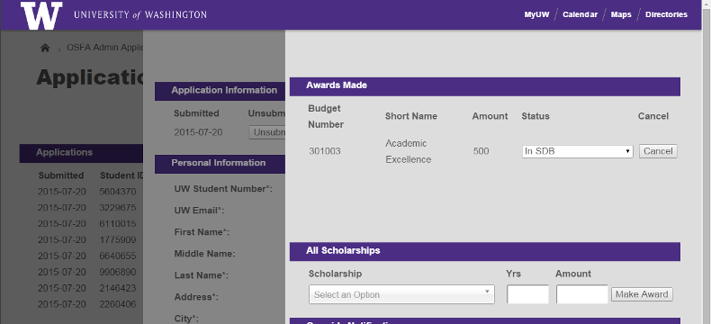

[](https://travis-ci.org/UWEnrollmentManagement/Framework)
[](https://codeclimate.com/github/UWEnrollmentManagement/Framework)
[](https://codeclimate.com/github/UWEnrollmentManagement/Framework/coverage)
[](https://packagist.org/packages/uwdoem/framework)

UWDOEM/Framework
=============

*Framework* is a modern PHP web framework built within the University of Washington's Office of Student Financial Aid.  
    
<br>
  
*Easily create forms and manage submission results in* Framework *created web-applications*

Applications built within *Framework* are:

  1. Legible  
  
     *Framework* separates declaring *what elements be on a page* from *what those elements should look like* and the logic of *how those elements should behave*. Under this model, creating a page is not much more complicated than simply listing the presentational elements that should be present.  
  
  2. Extensible  
  
    This separation of concerns also promotes reusability of components: a web-displayed table can be turned into Excel by changing a single line of code; a web-displayed form can be presented as a PDF by changing a single line of code. Adding a column to a table takes only one line, and in most cases *Framework* will be able to populate that column from the database without any further instruction.
  
  3. Secure

    *Framework* automatically provides strong protection against a number of web attacks, including CSRF, XSS, and database injection.  
    
    *Framework* also provides easy, seamless encryption for sensitive student information. Encrypting a database column requires a simple declaration in your model schema for each data-field you want to protect. Calls to and from the database on that encrypted data are transparent; *Framework* knows which fields are encrypted and handles the encryption/decryption behind the scenes.
    
  4. Pretty  

    *Framework* includes page templates derived from the University of Washington's Boundless theme and styling. Additional user-interface elements extend that brand's base functionality. And these default templates can be easily overridden with custom themes to implement your own department or organization's brand.


Installation
===============

This library is published on packagist. To install using Composer, add the "uwdoem/encryption": ">=0.2" line to your "require" dependencies:

```
{
    "require": {
        "uwdoem/framework": ">=0.2"
    }
}
```

Because Framework depends on multiple other libraries, it is *highly* recommended that you use Composer to install this library.

Use
===

Instructions to follow.

Compatibility
=============

* PHP 5.5, 5.6, 7.0

Todo
====

See GitHub [issue tracker](https://github.com/UWEnrollmentManagement/Framework/issues/).

License
====

Employees of the University of Washington may use this code in any capacity, without reservation. This code is provided in the hope that it may be useful. However, providing does not imply that any organization involved in its creation or provision will provide support or assume liability for its use.

Getting Involved
================

Feel free to open pull requests or issues. [GitHub](https://github.com/UWEnrollmentManagement/Framework) is the canonical location of this project.
