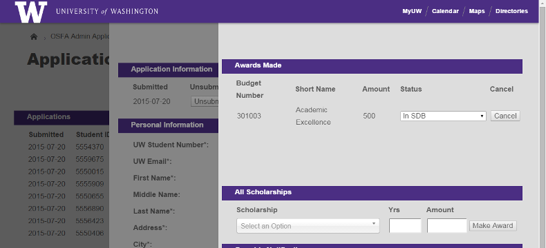

[](https://travis-ci.org/UWEnrollmentManagement/Framework)
[](https://codeclimate.com/github/UWEnrollmentManagement/Framework)
[](https://codeclimate.com/github/UWEnrollmentManagement/Framework/coverage)
[](https://packagist.org/packages/athens/core)

ATHENS/Framework
=============

*Framework* is a modern PHP web framework built within the University of Washington's Office of Student Financial Aid.  
    
<br>
  
*Easily create forms and manage submission results in* Framework *created web-applications*

Applications built within *Framework* are:

  1. Legible  
  
     *Framework* separates declaring *what elements shall be on a page* from *what those elements should look like* and the logic of *how those elements should behave*. Under this model, creating a page is not much more complicated than simply listing the presentational elements that should be present.  
  
  2. Extensible  
  
    This separation of concerns also promotes reusability of components: a web-displayed table can be turned into Excel by changing a single line of code; a web-displayed form can be presented as a PDF by changing a single line of code. Adding a column to a table takes only one line, and in most cases *Framework* will be able to populate that column from the database without any further instruction.
  
  3. Secure

    *Framework* automatically provides strong protection against a number of web attacks, including CSRF, XSS, and database injection.  
    
    *Framework* also provides easy, seamless encryption for sensitive student information. Encrypting a database column requires a simple declaration in your model schema for each data-field you want to protect. Calls to and from the database on that encrypted data are transparent; *Framework* knows which fields are encrypted and handles the encryption/decryption behind the scenes.
    
  4. Attractive  

    *Framework* includes page templates derived from the University of Washington's Boundless theme and styling. Additional user-interface elements extend that brand's base functionality. And these default templates can be easily overridden with custom themes to implement your own department or organization's brand.


Installation
===============

This library is published on packagist. To install using Composer, add the "athens/core": "0.*" line to your "require" dependencies:

```
{
    "require": {
        ...
        "athens/core": "0.*",
        ...
    }
}
```

Because Framework depends on multiple other libraries, it is *highly* recommended that you use [Composer](https://getcomposer.org/) to install this library and manage dependencies.

Use
===

Here's a small, suggestive sample of how to use Framework. For more information, see the [documentation](doc/index.md), especially the [application creation tutorial](doc/application-creation.md).

Framework uses classes generated by [PropelORM](http://propelorm.org/) to store and retrieve database rows. First, we define a student class in schema.xml:
```
<table name="student">
    <column name="id" type="integer" required="true" primaryKey="true" autoIncrement="true"/>

    <column name="uw_student_number" type="varchar" size="7" required="true" phpName="UWStudentNumber"/>
    <column name="first_name" type="varchar" size="127" required="true"/>
    <column name="middle_initial" type="varchar" size="15" required="true"/>
    <column name="last_name" type="varchar" size="127" required="true"/>
    <column name="last_four_ssn" type="varchar" size="4" required="true"/>
</table>
```

Now we can use Propel to generate a `Student` class and create form which will store a student in the database:
```
<?php

require_once dirname(__FILE__) ."/../setup.php";

use Athens\Core\Form\FormBuilder;
use Athens\Core\Page\PageBuilder;
use Athens\Core\Page\Page;

use MyProject\Student;


$form = FormBuilder::begin()
    ->setId("student-form")
    ->addObject(new Student())
    ->build();

$page = PageBuilder::begin()
    ->setType(Page::PAGE_TYPE_FULL_HEADER)
    ->setTitle("My Project: Enter a Student")
    ->setHeader("My Project")
    ->setSubHeader("Enter a Student")
    ->setBaseHref("..")
    ->setWritable($form)
    ->build();

$page->render(null, null);
```

Compatibility
=============

* PHP 5.5, 5.6, 7.0

Todo
====

See GitHub [issue tracker](https://github.com/UWEnrollmentManagement/Framework/issues/).

Getting Involved
================

Feel free to open pull requests or issues. [GitHub](https://github.com/UWEnrollmentManagement/Framework) is the canonical location of this project.

Here's the general sequence of events for code contribution:

1. Open an issue in the [issue tracker](https://github.com/UWEnrollmentManagement/Framework/issues/).
2. In any order:
  * Submit a pull request with a **failing** test that demonstrates the issue/feature.
  * Get acknowledgement/concurrence.
3. Revise your pull request to pass the test in (2). Include documentation, if appropriate.

[PSR-2](https://github.com/php-fig/fig-standards/blob/master/accepted/PSR-2-coding-style-guide.md) compliance is enforced by [CodeSniffer](https://github.com/squizlabs/PHP_CodeSniffer) in Travis.
