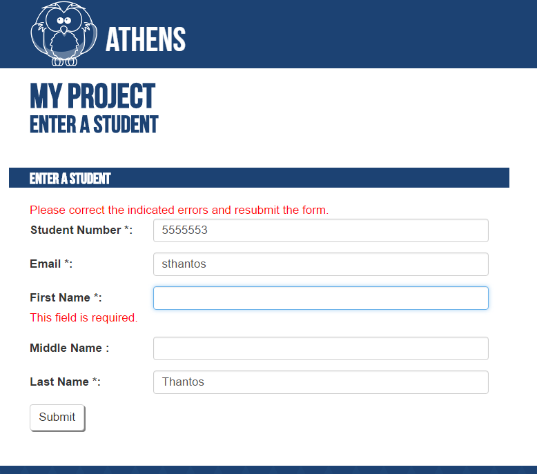

Application Creation Tutorial
=============================

This tutorial is the first of three parts:

  1. Application creation
  
  2. [Application deployment](application-deployment.md)
  
  3. [Application modification](application-modification.md)
  
This tutorial assumes that you're creating this new project in your development environment, and then later deploying the code into your production environment. If you have no development environment, you can follow these same instructions to create a new project into your development environment.

Prerequisites
-------------

To complete this tutorial, you must first have:

  1. A working development php web server environment
  
  2. Access to the command-line command `php`
  
  3. A development MySQL database which can be dedicated to this project, plus user credentials for a user with full privileges on that database


Steps
-----

* Create the development project web root:

  Like any other Php project, your Framework project needs to live inside of a web root. You can create a directory inside of your server's web root and use that as a project web root, or you can use the server's web root directly as your project web root.
  
  For example, if your server's web root is `/www`, then you could create the directory `/www/myproject`. The directory `/www/myproject` would be your project web root.
  
  All of the example commands in this tutorial are issued from within your project web root. All files created are relative to your project web root.
  
* Install Composer:

  Composer is a dependency manager for Php: you tell it what packages your project requires, and it fetches the appropriate versions of those packages, along with any packages required by *those* packages.
  
  There are two flavors of Composer installation available: local or global. In a local install, Composer resides as a file `composer.phar` in your web root. In a global install, Composer resides in your system files and may be called from any directory.
  
  In a local install, you invoke Composer using `php composer.phar ...` from your project web root. In a global install, you invoke Composer using `composer ...`. This tutorial assumes that you are using a local install, but if you have a global install then replace all examples which use `php composer.phar ...` with `composer ...`.
  
  To install locally in a *nix environment `cd` into your project web root and type:
  ```
  curl -sS https://getcomposer.org/installer | php
  ```
  
  To install in a Windows environment, see the [Composer downloads page](https://getcomposer.org/download/). If you use the Composer Windows installer, then you'll end up with a global install.

* Create the project's `composer.json`:
  
  Create the following file, named `composer.json` in your project's web root:
  ```
  {
    "require": {
      "propel/propel": "~2.0@dev",
      "uwdoem/framework": "0.*"
    },
    "require-dev": {
      "phpunit/phpunit": "4.5.*",
      "phpunit/phpunit-selenium": ">=1.2",
      "phpdocumentor/phpdocumentor": "2.7.*"
    }
  }
  ```
  
  This is where you tell Composer which packages your projects require. Notice that we have included Framework as a dependency. You can add more packages to this list later. For more information, see the [composer.json schema documentation](https://getcomposer.org/doc/04-schema.md).

* Initial install of requirements:

  Now we tell composer to download our project's dependencies:
  ```
  php composer.phar install
  ```

* Initialize the project:
  
  Now that Framework is installed, we use it to create the bare-bones of a Framework project.
  ```
  php vendor/uwdoem/framework/bin/manage.php init
  ```
  
  This command creates a handful of directories and files in your project web root, as well as adding a few directives to your composer.json.
  
* Edit the local settings:

  Edit the file `local-settings.php` and replace all instances of `SET_ME` with the appropriate values. All of the settings should be string literals--enclosed in quotes--unless otherwise indicated.
  
  Note that `local-settings.php` is *excluded* from version control. This means that it will *not* be synchronized between your development and production environments. It also doesn't go into your code repository, so it's *OK* to put passwords into it, unless you expose `local-settings.php` to other risks.
  
* Edit the file `settings.php`:

  Edit the database `APPLICATION_NAME` constant to the same value as `MYSQL_DB_NAME` in `local-settings.php`.

* Edit the file `project-schema/schema.xml':

  First, edit the database `name` attribute to the same value as `MYSQL_DB_NAME` in `local-settings.php`. Then edit the database `namespace` attribute with a [PascalCased](http://c2.com/cgi/wiki?PascalCase) class name for your project. This tutorial uses "MyProject". 

  Framework uses [Propel](http://propelorm.org/) to manage the code<->database interface. This kind of helper library is known as an [ORM](http://stackoverflow.com/a/1279678).
  
  The file `project-schema/schema.xml` is where we define the database tables which will house our data. Propel then both creates these tables in our database and also creates a set of Php classes which allow us to retrieve and insert records using an object interface. To learn more about schema creation read the Propel documentation, beginning with ['The Build Time'](http://propelorm.org/documentation/02-buildtime.html).
  
  The initial Framework project includes a commented-out definition for a student table. To proceed with this tutorial, *uncomment that definition*. If you are already familiar with Framework, then at this point you could delete the student table definition and create your own table definitions.
  
* Build the database and objects:

  `cd` into `project-schema` and then issue the following commands:
  
  ```
  php ../vendor/propel/propel/bin/propel.php model:build;
  php ../vendor/propel/propel/bin/propel.php sql:build;
  php ../vendor/propel/propel/bin/propel.php sql:insert;
  ```
  
  These commands generate Php classes from your `project-schema/schema.xml`, generate SQL statements to create a database table for each of your schema classes, and then insert those tables into your database.
  
  Now `cd` back into your project web root and issue the following:
  ```
  php composer.phar dump-autoload
  ```
  
* Edit your .htaccess files:

  The default project assumes that you may have some set of pages which will be accessible to all users, and some set of pages which will only be accessible to some privileged class of users. The former can be placed in `pages/` and the latter can be placed in `admin/`.
  
  You **must** edit `pages/.htaccess` and `admin/.htaccess` to reflect these rules. By default, both `pages/.htaccess` and `admin/.htaccess` will block *all* requests.

* Create a couple of simple pages:
  
  You can now create a couple of simple web pages. Assuming that you are using the student table provided by Framework, let's create a public form which allows us to enter students into the database, and a private table for viewing students.

  Create the following `pages/enter-student.php` file:
  
  ```
  <?php

  require_once dirname(__FILE__) ."/../setup.php";
  
  use UWDOEM\Framework\Form\FormBuilder;
  use UWDOEM\Framework\Page\PageBuilder;
  use UWDOEM\Framework\Page\Page;
  
  use MyProject\Student;
  
  $form = FormBuilder::begin()
      ->setId("student-form")
      ->addObject(new Student())
      ->build();
      
  $page = PageBuilder::begin()
      ->setId('student-entry-page')
      ->setType(Page::PAGE_TYPE_FULL_HEADER)
      ->setTitle("My Project: Enter a Student")
      ->setHeader("My Project")
      ->setSubHeader("Enter a Student")
      ->setBaseHref("..")
      ->setWritable($form)
      ->build();

  $page->render(null, null);
  ```
  
  Now try visiting `pages/enter-student.php` in your web browser. Try submitting a student. Try submitting a student while neglecting to provide a required field. Try submitting a student and then viewing the results in your database.
  
  <br>
  *Your student entry page. At only 20 lines, it knows how to validate fields and save students to the database.*
  
  It's an extremely basic form, but it already knows how to detect and report form errors, and how to save its results in the database. We'll make some improvements to this form in the following section on making changes to an existing project.

  Now create the following `admin/student-table.php` file:
  ```
  <?php

  require_once dirname(__FILE__) ."/../setup.php";
  
  use UWDOEM\Framework\Page\PageBuilder;
  use UWDOEM\Framework\Page\Page;
  use UWDOEM\Framework\Row\RowBuilder;
  use UWDOEM\Framework\Table\TableBuilder;
  
  use MyProject\StudentQuery;
  
  
  $students = StudentQuery::create()->find();
  
  $rows = [];
  foreach ($students as $student) {
      $rows[] = RowBuilder::begin()->addObject($student)->build();
  }
  
  $table = TableBuilder::begin()
      ->setId("students-table")
      ->setRows($rows)
      ->build();
      
  $page = PageBuilder::begin()
      ->setId('student-view-page')
      ->setType(Page::PAGE_TYPE_FULL_HEADER)
      ->setTitle("My Project: View Students")
      ->setHeader("My Project")
      ->setSubHeader("View Students")
      ->setBaseHref("..")
      ->setWritable($table)
      ->build();

  $page->render(null, null);
  ```
  
  <br>
  *Your table of students. At only 30 lines, it knows how to retrieve and display students.*
  
  This is also a very basic table, but it already knows how to load students from the database, display them as rows, and include the appropriate column headers. We'll also make some improvements to it on the section below on making changes to an existing project.
  
  * Upload to your code repository:

  If you use an IDE, it may place files into your project web root. Before uploading your code to your repository, be sure to exclude those files using your .gitignore file.
  
  However, creating a code repository, initializing your code directory, and pushing it to the repo are beyond the scope of this tutorial.
 
Next Steps
----------

See the next step in this tutorial: [Application deployment](application-deployment.md).
